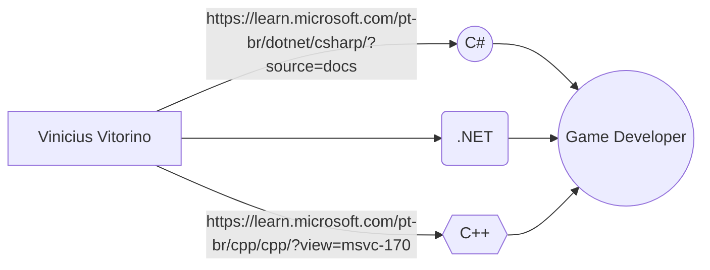

# Estudos C#
 _**Novo repositório destinado aos estudo com a linguagem de programação C#**_

## Licensa MIT 

**Software Livre Claro que sim !**
---
🛫🎯

|||
:---: | :---: | :---:

***

[guia-markdown.pdf](https://github.com/user-attachments/files/16184420/guia-markdown.pdf)

